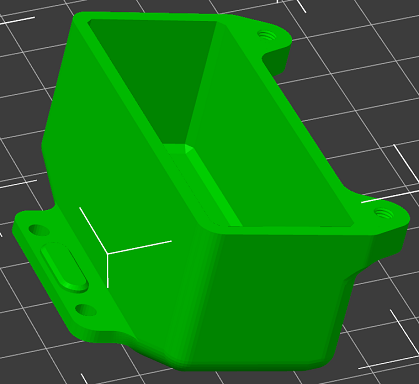
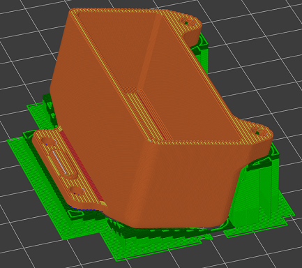
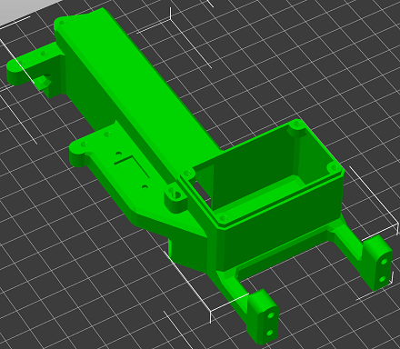
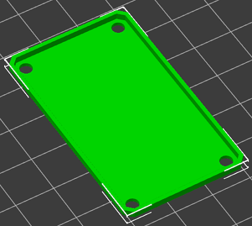
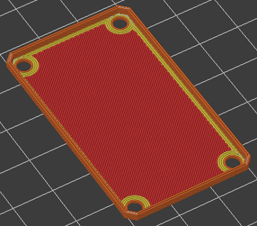
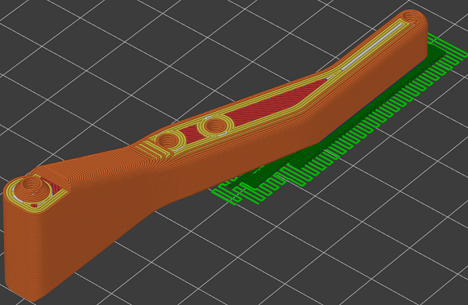
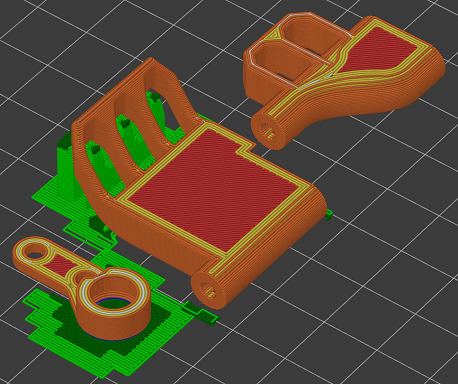
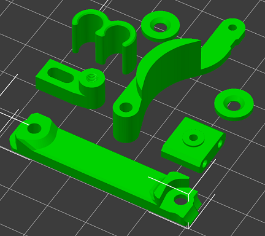

# 0.4mm Nozzle Parts

## Material / part requirements:

* Carbon-Fiber PA6 Nylon (Polymaker Polymide CF-PA6)
* Filament dryer which can dry Nylon
* 0.4mm hardened nozzle at 300°C
* Magigoo PA on 45°C bed
* Print each part one at a time to keep the layer time as short as possible. This makes layer adhesion as strong as possible.

## Slicer settings:

Assuming your hot end is up to the task of printing abrasives at 300°C and you've got a filament dryer capable of drying Nylon, printing CF-PA6 Nylon isn't too tricky. The sizing of these parts and this guide assume you'll be using PrusaSlicer. 
Here's the general slicer settings I use:

* Nozzle - 300°C
* Bed - 45°C
* Part cooling fan off (100% for bridging **ONLY**)
* Minimum layer time - 0 seconds (PrusaSlicer calculates whacky layer times when generating support material)
* 1.4mm retraction (This works on my MK3S extruder with an E3D Volcano and Nozzle-X)
* Extrusion Width - 0.5mm for everything except support material which is 0.4mm
* Layer Height - 0.15mm-0.25mm (I used 0.25mm for most parts)
    * Using a 0.5mm extrusion width allows up to 0.25mm layer height while maintaining good layer adhesion
    * I've not really noticed reduced layer adhesion within this layer height range.
* Perimeters - 4 (2mm)
* Top/Bottom layers - 1 (because 100% infill)
* Detect thin walls
* Detect bridging perimeters
* Don't support bridges
* 100% infill
* Support Contact Z Distance - 0.05mm (smaller gap improves layer adhesion with these layers)
* XY separation between an object and its support - 1.2mm to keep support from being printed in the middle of M3 threaded holes
* Print speed - 40mm/s-80mm/s (infill and support fast, small/external perimeters slow)
* Bridge speed - 30mm/s
* Bridge flow ratio - 0.55 (Whatever you arrived at with calibration prints)
* Extrusion Multiplier - 0.86 (Whatever you arrived at with calibration prints)

## Post-Processing

* There should not be blobs - if you see blobs, it's likely your hot end is leaking and needs to be hot-tightened. A loose hot end can cause all kinds of strange print quality issues.
* Remove support material as soon as possible
* You will find small pieces of plastic stuck to these prints. These should easily scrape off using a hobby knife and flat bladed screwdriver.
* Apply Medium or Thin CA glue to the bridge layers to strengthen parts where layer adhesion is less than optimal. Allow it to fully dry before assembly because it can leave a white residue on anything that is near it while it's drying.

* Cut away bridging layers which obscure holes. The purpose of these is to reduce support material.

## Rear Battery Box Top (Rear-Battery Option):

* All layer widths - 0.45mm (so the sides are 5 perimeters thick)
* No support Material
* 100% bridging fan
* Bridging angle - Set it to go across at 45°

## Rear Battery Box Bottom (Rear-Battery Option):

* 0.2mm max layer height (better for overhangs)
* All layer widths - 0.45mm (so the sides are 5 perimeters thick)
* Support on build plate only (only on outside of part)
* 100% bridging fan

## Transmission Case Top:

* Inside dimensions are critical on this part, so that side must face up
* Support on build plate only
* 100% bridging fan
* Bridging angle - Set it to go across the shortest edge

## Transmission Case Bottom:

* Inside dimensions are critical on this part, so that side must face up
* Support on build plate only
* No part cooling

### Transmission Cases Post-Processing:
* File smooth mating surfaces
* Glue Bridging areas

## Electronics Tray:

* Support on build plate only
* 5mm brim
* 100% bridging fan
* Bridging angle - Set it to go diagonal across large gaps

### Post-Processing:
* Glue Bridging areas
* Remove bridging layer from switch cutout, screw holes, and antenna hole
* File brake mount area until brake mount fits flush with bottom

## Receiver Cover:

* No support Material
* No part cooling

## Front Chassis Braces:

* Support on build plate only
* 30% Gyroid infill
* At least 1mm or 4 top and bottom layers
* No part cooling
* Print one at a time

## Fuel Tank Mounts:

* Support on build plate only
* 30% Gyroid infill
* At least 1mm or 4 top and bottom layers
* No part cooling
* Print one at a time if needed to keep layer time under 60 seconds

## Small Parts:

* Includes the following parts -
    * Brake lever
    * Brake Mount
    * Chassis shim (x4)
    * Fuel line clip
    * Servo slider
    * Tank mount chassis shim
    * Transmission brace
* No support Material
* No part cooling
* Print fewer parts at a time as needed to keep layer time under 60 seconds

