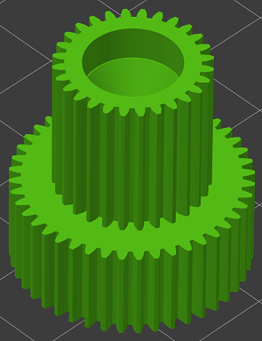
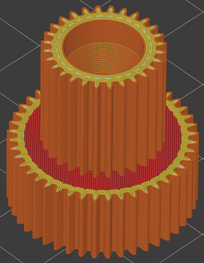
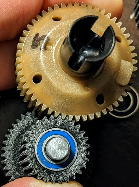
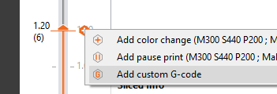
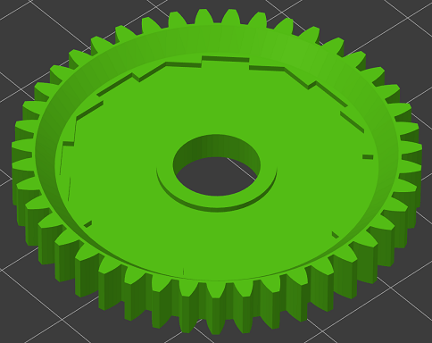
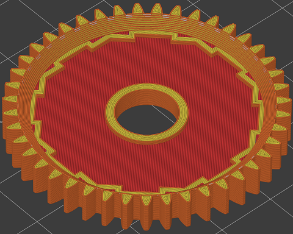

# 0.25mm Nozzle Parts

## Material / part requirements:

* Carbon-Fiber PA6 Nylon (Polymaker Polymide CF-PA6)
* Filament dryer which can dry Nylon
* 0.25mm hardened nozzle at 300°C
* Magigoo PA on 45°C bed
* Print each part one at a time to keep the layer time as short as possible. This makes layer adhesion as strong as possible.

## Slicer settings:

Assuming your hot end is up to the task of printing abrasives at 300°C and you've got a filament dryer capable of drying Nylon, printing CF-PA6 Nylon isn't too tricky. The sizing of these parts and this guide assume you'll be using PrusaSlicer. 
Here's the general slicer settings I use:

* Nozzle - 300°C
* Bed - 45°C
* Part cooling fan off (100% for bridging **ONLY**)
* Minimum layer time - 0 seconds (PrusaSlicer calculates whacky layer times when generating support material)
* 1.4mm retraction (This works on my Printrbot extruder with an E3D V-6 and Nozzle-X)
* Lift Z on retract - 0.2mm
* Minimum travel after retraction - 1mm
* Extrusion Width - 0.3mm for everything except:
    * Support material - 90% (0.225mm)
    * Perimeters - 0.25mm
* Layer Height - I used 0.125mm (0.1 - 0.2)
* Perimeters - 5 (1.25mm)
* Top/Bottom layers - 1.5mm
* Avoid crossing perimeters
* Detect thin walls
* Detect bridging perimeters
* No support Material
* 20% or more Gyroid infill (only used on big side of the gear)
* Print speed - 40mm/s-80mm/s (infill and support fast, small/external perimeters slow)
* Bridge speed - 30mm/s
* Bridge flow ratio - 0.64 (Currently, lower values with this nozzle size cause PrusaSlicer to use this for solid infill also, which is BAD)
* Extrusion Multiplier - I used 0.86 (Whatever you arrived at with calibration prints)

## Post-Processing

* There should not be blobs - if you see blobs, it's likely your hot end is leaking and needs to be hot-tightened. A loose hot end can cause all kinds of strange print quality issues.
* You will find small pieces of plastic stuck to the inner surfaces. These should easily scrape off using the back edge of a hobby knife.
* If you find small pieces of plastic stuck to the outer surfaces, it should be easy to pick or scrape off with a hobby knife.
* Removing stray plastic from these pieces is critical to get the fit for bearings and gear mesh.

## Idler Gear:

* XY Size Compensation - I used -0.05 (usually between 0.00 and -0.07mm)
    * You'll need to test-fit this gear in the transmission to fine-tune this. It should be a tight mesh and feel like it needs to break-in a little. Only go negative on this one, and not so far you lose the 2nd perimeter in each gear tooth. If this is not enough to get the right fit, adjust your extrusion multiplier by 1% or 2%.
    * Make sure the idler gear fully meshes with the diff gear. The full height of the idler gear teeth should interlock with the diff gear teeth, not just the tops.
* No part cooling

## Spur Gear:

* XY Size Compensation - Same as you used for printing Idler Gear
* 100% bridging fan (layer adhesion isn't critical for this part)
* 100% fan on layer after bridging layer (This will keep bridge layer from warping)

    
    * Move the top layer view slider (In PrusaSlicer) to the first layer after the bridging layer
    * Right-click the "+" and select "Add Custom G-Code"
    * Type 'M106 S255' and click OK (for single-extruder printers with Marlin firmware)
        * You can try slower fan speeds here as long as the underside stays flat after the next few layers
    * Move the top layer view slider (In PrusaSlicer) to the next layer
    * Right-click the "+" and select "Add Custom G-Code"
    * Type 'M106 S0' and click OK

* Bed adhesion is more difficult on this part. If you have trouble with it lifting off the bed, make sure your first layer has enough squish. Thoroughly clean the bed and use a fresh layer of Magigoo PA. You can also use less solid infill layers to decrease internal stresses. I recommend at least 4 top and bottom infill layers.

