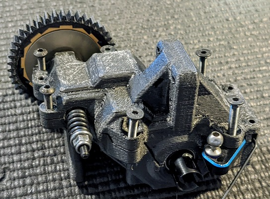

# Assembly Guide

## Install Front Chassis Braces
* Screws:
    * (4) M3 x 10mm countersunk (for front 2 holes)
    * (2) M3 x 8mm countersunk (for rear hole)

    

## Install Front Clip and Bumper
* Screws:
    * (4) M3 x 16mm countersunk (for bottom)
    * (2) M3 x 12mm button head (for top)

    

## Install Steering Servo
* Screws:
    * (2) M3 x 10mm button head

    

## Assemble Transmission
* Insert 3/8 x 5/8 bearing into spur gear

  
* Assemble 3-gear (shorter) top-shaft with spur gear offset facing the shaft

  
* Install camber link block in bottom transmission case 
  * (1) M2.5 x 8mm countersunk

  
* Install idler shaft and bearings into idler gear

  
* Install differential, idler, top-shaft, and swaybar in bottom transmission case and grease gears with black grease

  
* Install top transmission case and screws
  * (2) M3 x 16mm countersunk (top rear)
  * (2) M3 x 12mm countersunk (top middle)
  * (2) M3 x 8mm button head (top front)

  

## Install Transmission and Rear Shock Tower
  * (3) M3 x 10mm countersunk (front 3 transmission screws)
  * (4) M3 x 12mm button head
    
    

## Install Transmission and Suspension    
  * (2) M3 x 16mm countersunk (rear D-Block screws)
  * (2) M3 x 6 button head (swaybar screws)

    

## Assemble Rear Battery Box (OPTIONAL)
* Wrap a layer of tape around the battery as needed to protect the shrink wrap

    
* Screw battery box together
  * (2) M3 x 8mm button head

  

## Install Rear Battery Box (OPTIONAL)
* (2) M3 x 8 button head (top battery box mount)
* Replace rear bumper with rear battery box and use 8mm button head screws to mount top of box in swaybar screw holes

    

## Authors

Contributors names and contact info

So far it's just me here... Contributions are welcome!
Damon Palm

## Version History

* 0.1
    * Initial Release

## License

This project is licensed under the GNU General Public License v3.0 License - see the [LICENSE File](LICENSE) for details