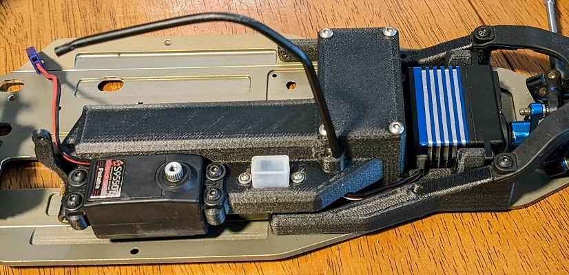

# Assembly Guide

# Front End Assembly

## Install Front Chassis Braces
  * Screws - (4) M3 x 10mm countersunk (front 2 holes)
  * Screws - (2) M3 x 8mm countersunk (rear hole)

## Install Front Clip and Bumper
  * Screws - (4) M3 x 16mm countersunk (bottom)
  * Screws - (2) M3 x 12mm button head (top)

  

# Rear End Assembly

## Assemble Slipper and Top Shaft
* Insert 3/16 x 3/8 bearing into spur gear

* Assemble slipper and 3-gear (shorter) top-shaft with spur gear offset facing the inner slipper plate

## Assemble Transmission
  * Screws - ( 1) M2.5 x 8mm countersunk
* Install camber link block in bottom transmission case

* Install idler shaft and 5x10x4 bearings into idler gear

* Install differential, idler, top-shaft, and swaybar in bottom transmission case and grease gears with black grease

  * Screws - (2) M3 x 16mm countersunk (rear)
  * Screws - (2) M3 x 12mm countersunk (middle)
  * Screws - (2) M3 x 8mm button head (front)
* Install top transmission case and screws

## Install Transmission and Rear Shock Tower
  * Screws - (3) M3 x 10mm countersunk (front 3 transmission screws)
  * Screws - (4) M3 x 12mm button head (shock tower)
    

## Install Transmission and Suspension (Mid-Battery Option)    
  * Screws - (2) M3 x 16mm countersunk (rear D-Block screws)
  * Screws - (2) M3 x 6 button head (swaybar screws)
* Secure D-Block and bumper using 16mm countersunk screws.
* Insert swaybar screws far enough to take slop out of the swaybar while allowing it to swing freely

## Assemble Rear Battery Box (Rear-Battery Option)
* Wrap a layer of tape around the battery as needed to protect the shrink wrap and insert battery into top of battery box

  * Screws - (2) M3 x 8mm button head
* Screw battery box together

## Install Rear Battery Box (Rear-Battery Option)
  * Screws - (2) M3 x 16mm countersunk (rear D-Block screws)
  * Screws - (2) M3 x 8 button head (top battery box mount)
* Attach bottom battery box where bumper normally goes using 16mm countersunk screws
* Use 8mm button head screws to secure top battery box in swaybar screw holes. These should get tight enough to take slop out of the swaybar while allowing it to swing freely while securing the battery box

# Electronics Tray Assembly

## Chassis Shims
* Glue chassis shims countersunk side down onto the 2 middle mounting holes as shown in the next step

## Install Mid Battery (Mid-Battery Option)
* Wrap a layer of tape around the battery as needed to protect the shrink wrap and insert battery into mid battery compartment

## Install Steering Servo
  * Screws - (2) M3 x 10mm button head (top screws)
  * Screws - (2) M3 x 8 button head (bottom screws)
* Bottom side of servo should be flush or slightly higher than the bottom surface of the electronics tray

## Install Switch and Throttle Servo
  * Switch screws - (2) whatever the switch came with
  * Screws - (4) M3 x 8-10mm button head (throttle servo)
* Servo wire can tuck behind switch
* Switch wire tucks behind throttle servo (rear battery option)

## Install Receiver, transponder, antenna tube
  * Screws - (4) M3 x 6mm button head (receiver box cover)
  * Screws - (1) M3 x 4 set screw (antenna tube)
* Insert a layer of open cell foam in the bottom of the receiver box
* Plug switch, servos, and transponder into receiver

* Feed antenna wire through antenna hole leaving enough slack to remove receiver from receiver box
* Feed antenna into antenna tube and install it using set screw
* Insert receiver, fold wires on top
* Insert transponder on top of wires

* Insert a layer of open cell foam on top of transponder
* Install receiver box cover using button head screws

## Assemble brake
  * Screws - (1) M3 x 16mm button head (brake arm)
  * Screws - (1) M3 x 12mm button head (brake mount)
* Cut out and glue 1/16" thick piece of cork onto brake arm (This is the brake pad)
* Drill brake linkage hole with 2mm drill bit (so a 2mm screw can rotate freely in it)

* Drill brake pivot hole with 3mm drill bit (so a 3mm screw can rotate in it, but have almost no slop)

* Assemble brake arm and brake mount using M3 x 16mm button head screw (Leave it loose enough to freely rotate)

* Assemble brake mount to electronics tray using M3 x 12mm button head screw (Leave it loose enough to be able to adjust the mount)

# Center Chassis Assembly

## Install Electronics Tray
  * Screws - (5) M3 x 10mm countersunk
* Install electronics tray in chassis using countersunk screws
* Snap steering link ballcup onto servo arm ballstud

## Install Transmission Brace
  * Screws - (2) M3 x 10mm countersunk
* Thread receiver switch wire and transmission brace through large heat shrink tubing (Rear battery option)
* Install transmission brace using countersunk screws
* Adjust slack in receiver switch wire, leaving room for brake lever to move all the way forward (Rear battery option)
* Shrink heatshrink using heat gun (Rear battery option)
* Secure receiver battery wire using small wire tie (Rear battery option)

## Install Fuel Tank
  * 

# 
## Authors

Contributors names and contact info

So far it's just me here... Contributions are welcome!
Damon Palm

## Version History

* 0.1
    * Initial Release

## License

This project is licensed under the GNU General Public License v3.0 License - see the [LICENSE File](LICENSE) for details