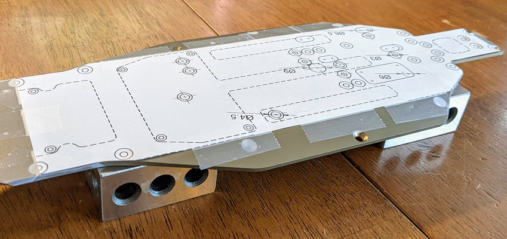
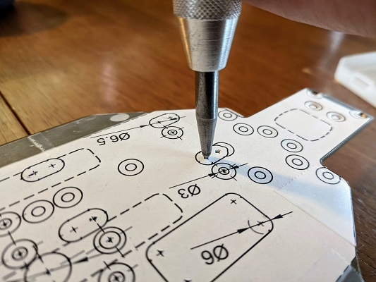
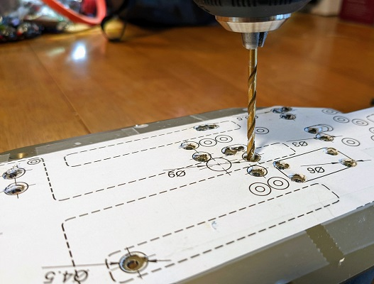
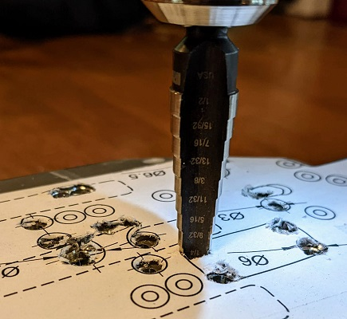
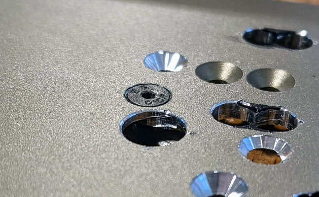
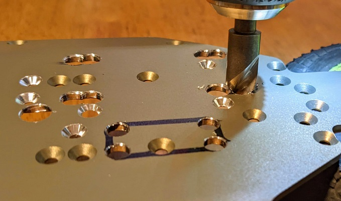
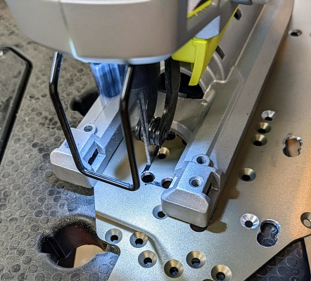
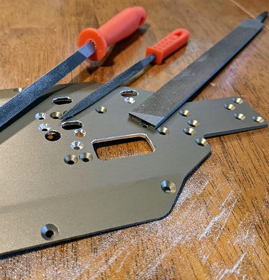

# T6.1 Chassis
## Intro
Time to bust out the center-punch, drill, jigsaw, metal files, and kiss your chassis goodbye!

Make no mistake, you may destroy a perfectly good chassis. Even if everything goes right, you probably won't be using it as an electric chassis again (the rearmost right-side waterfall mount hole is gone).

Basically, you'll be printing out a paper template, taping it to the chassis, marking the holes and cutout with the center-punch and sharpie, and hacking the chassis with power tools. Take your time and you won't need to do it more than once.

## Tools
* Metal center-punch
* Cordless drill or drill press
* 2mm, 3mm and stepped drill bits
* Countersinking bit
* Jigsaw with skinny blade that fits into a 1/4" hole
* Assorted files (round and flat)

## Work
* Download and print the chassis template PDF at 100% scale
* Cut it out and tape it to the bottom of your chassis, making sure existing holes line up

* Sit the chassis on something solid and use a center-punch to all mark hole centers and edges of larger holes and slots

  

* Drill all hole centers with smaller drill bit, then drill them to final size with the 3mm drill bit

  

* Use a stepped drill bit to drill larger holes, engine mount slot ends, and corners of flywheel cutout

  
* Use a countersinking bit to countersink all screw holes. Check fitment of each hole with a screw making sure it sits flush in each hole

  
* Use a countersinking bit to deburr both sides of each hole
* Use a sharpie to mark the edges of the flywheel cutout and engine mount slots

  
* Use a jigsaw to cut out flywheel hole and engine mount slot edges

  
* Use metal files to smooth and deburr flywheel cutout and engine mount slots

  
* sit back and admire your handy work!

## Authors

Contributors names and contact info

So far it's just me here... Contributions are welcome!
Damon Palm

## Version History

* 0.1
    * Initial Release

## License

This project is licensed under the GNU General Public License v3.0 License - see the [LICENSE File](LICENSE) for details