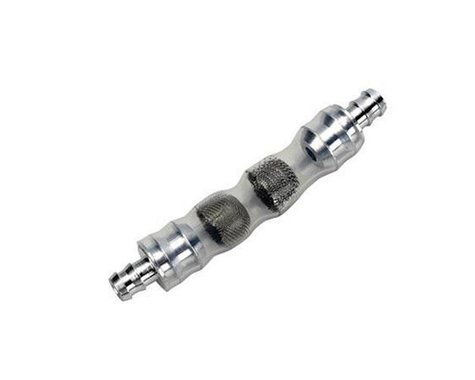
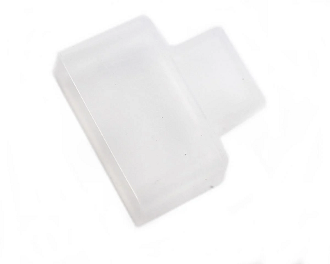

# Purchased Parts

## Off the shelf parts you will need to complete this build
There are seperate folders and guides for each of these items:

* Associated RC10T6 series truck

  
* .12ci (2.1cc) Nitro engine
  * I used an **SH Engines .12 Pro Rear Exhaust Touring Car & Truck Nitro Engine (Turbo Plug)** (SHEPT12R02SXT-1). This is basically the same as the old Dynamite Platinum 12, but with a slide carburetor. It's easy to tune, runs smooth, and has plenty of power for a 2WD truck.

  
* Exhaust header/pipe
  * Currently only Ignite RC has a proper 1/10th scale off-road header and pipe (IG006). I ended up finding a used Losi rear-exhaust header and pipe. (Picture is of RC10GT2 header and pipe)

  
* Air filter
  * I used a **Traxxas Complete Air Filter Set (TMX 2.5, 3.3)** (TRA5260). It might seem too large for this carburetor, but the included zip-tie clamps it down good and it seals fine. Motor Saver also has some very nice 1/10th size filters.

  
* 75cc Fuel Tank (for Redcat/HSP 1/10th scale) These can be found on Amazon for around $10-$15

  
* Fuel Filter
  * These tanks don't have filters, so this is necessary. I use a small Sullivan "Crap Trap" filter (SUL187).

  
* Standard size silicon fuel line

  
* 32mm (Kyosho style) 1/8th scale clutch
  * I used a **Fioroni 32mm Quattro "Original RED" 4-Shoe Adjustable Clutch System** (FIO-OT-FR104-R). I've been very happy with this setup, and since it is standard 1/8th stuff, you have lots of tuning options.

  
* 16T Mugen/OFNA style clutch bell
  * I used a **ProTek RC Hardened Clutch Bell w/Bearings (16T) (Mugen/OFNA Style)** (PTK-7053) because it uses HUGE bearings which shouldn't wear out for a very long time.

  
* Team Associated B6.1/B6.1D Standup Top Shaft (ASC91798)

  
* Team Associated Throttle/Brake Linkage Set (ASC81251)
  * Other similar linkage sets might work, but I really can't say for sure.

  
* Silicon switch cover
  * I used a **Mugen Seiki Switch Cover** (MUGB0401). Other 1/8th offroad switch covers are likely to work also.

  
* Receiver switch
  * I have a Sanwa receiver, so I used a Sanwa switch (SNW107A20064A). Since this kit uses LiPo receiver batteries, a charge plug is not necessary. I just plug the balance plug into my charger.

  
* Receiver Battery (Mid - for smooth, high-grip tracks) - Mugen/AE/8ight-X style LiPo pack (85 x 30 x 17mm) - (PTK-5196)

  

* Receiver Battery (Rear - for lower-grip tracks) - HB/8IGHT style LiPo pack (39 x 56 x 21mm) - (PTK-5171)

  

* Screws
  * 1 M3x? button head hex screws
  * 1 M3x? countersunk flat head hex screws

* Receiver / Servos (low profile servo for throttle)

## Authors

Contributors names and contact info

So far it's just me here... Contributions are welcome!
Damon Palm

## Version History

* 0.1
    * Initial Release

## License

This project is licensed under the GNU General Public License v3.0 License - see the [LICENSE File](LICENSE) for details