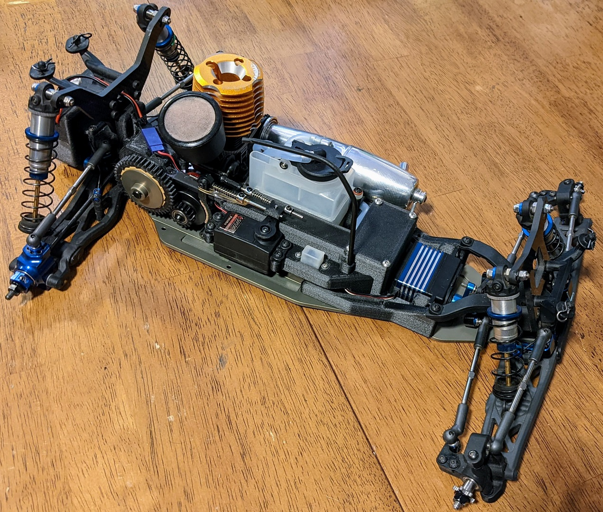

# Open-Gas-Truck

The original open-source gas truck conversion

## Associated T6 Series Gas Truck Conversion

There are separate sections and guides for each of these items:

* [3D-Printed parts](3D-Printed)
* [Laser-Cut parts](Laser-Cut-Parts)
* [Modified parts](Modified-Parts)
* [Purchased parts](Purchased-Parts)
* [Assembly](Assembly)

Here's the Fusion 360 (CAD) shares:

* [Full Assembly](https://a360.co/3vGxaeg)
* [Chassis Template Drawing](https://a360.co/3ybymYJ)
* [Laser-Cut Engine Mounts](https://a360.co/3Fe3Oad)
* [Laser-Cut Engine Mount Drawing](https://a360.co/3kD4iNH)

## Description

How to make your own gas truck conversion. Currently only the Associated T6 platform is done. TLR 22T conversion may happen if I or someone else feels very motivated and has the time to do so.

## Getting Started

First I must say this is a project for experienced makers/hobbyists. There may eventually be ready-to-assemble kit versions, but for now it's DIY only.

### Prerequisites

* 3D printer(s) with the following capabilities (for printing carbon-fiber PA6 Nylon)
    * Hard 0.4mm and 0.25mm nozzle (hardened steel or equivalent)
    * 300°C capable hot-end (make sure you hot-tighten it at that temperature)
    * Heated bed
* Filament dryer
* High quality Carbon-Fiber filled PA6 filament (I used Polymaker Polymide CF-PA6)
* Magigoo or equivalent PA bed adhesive
* Access to a laser cutting service such as send-cut-send
* A T6, 6.1, 6.2, or 6.3 you don't mind sacrificing to the gas truck gods :-)
* Lots of patience and some hacking skills

### Tools

* Printer for printing out chassis modification template
* Center-punch
* Cordless drill
* 3mm and stepped drill bits
* Countersinking bit
* High quality 3mm x 0.5mm tap and tap wrench
* Jigsaw with metal cutting blade
* Assorted files (round and flat)

## Authors

### Contributors names and contact info - *Contributions are welcome!*

* Damon Palm

## Version History

* 0.1
    * Initial Release

## License

This project is licensed under the **GNU General Public License v3.0 License** \- see the [LICENSE File](/LICENSE) for details